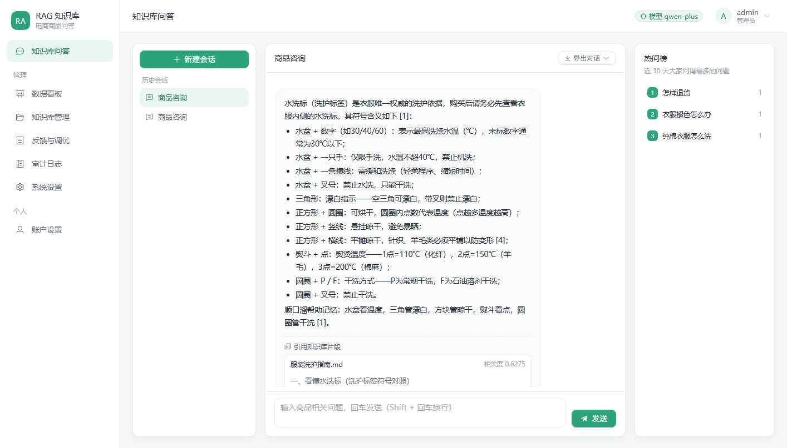

# 知客 ShopMind · 电商 RAG 知识库问答系统

毕业设计。一个跑在浏览器里的电商知识库问答系统：后台传商品文档，前台问问题，答案带引用片段，能点开核对原文。

技术栈是 LangChain + FastAPI + Vue3 + Chroma，模型走通义千问（DashScope，OpenAI 兼容协议，
换 DeepSeek / GLM 只改配置）。后端 4892 行 / 35 个文件，前端 3677 行 / 16 个文件，
44 个接口，10 个页面。



## 界面

四个主要页面，都是真跑起来截的（`docs/screenshots/`）：

| 截图 | 页面 | 说明 |
|---|---|---|
| [02-qa](docs/screenshots/02-qa.png) | 知识库问答 | 多会话，答案里带 `[1][2]` 编号引用，下面是引用片段原文 |
| [03-knowledge-base](docs/screenshots/03-knowledge-base.png) | 知识库管理 | 上传 / 下载原件 / 重索引 / 删除，表里是本机的真实分块数 |
| [04-dashboard](docs/screenshots/04-dashboard.png) | 数据看板 | 文档数、分块数、缓存命中率、平均时延、近 7 天提问量、热问 Top10 |
| [01-login](docs/screenshots/01-login.png) | 登录 | JWT，管理员 / 普通用户两种角色 |

## 一次提问走的路

```
问题 ─→ 语义缓存（余弦 ≥ 0.96 就当同一句话，直接返回，不花模型钱）
      └─→ 向量检索（Chroma）
          BM25 关键词检索（纯 Python 实现，不依赖任何检索库）   ← 两路并行召回
          　└→ RRF 融合（k=60）
          　　　└→ gte-rerank-v2 交叉编码器精排
          　　　　　└→ 拼 Prompt（片段带 [1][2] 编号，强制模型标出处）
          　　　　　　　└→ SSE 流式生成（引用片段先推，答案逐字跟上）
```

之所以要两路召回：向量擅长语义（「有点紧」↔「偏小」），但会把型号、尺码数字这种
精确串搜歪；BM25 正好反过来。融合之后两者互补。

## 几个我真正花了时间的地方

**1. 文档进来的时候，格式不能被搞坏。**
用户传 `.docx`，下载回来必须还是 `.docx`，一个字节都不能变（`data/uploads/` 存原件）。
Markdown 只在索引层当中间表示用，界面上从不出现 `|` `**` 这种源码。
所以有一条 `原始文件 → Word→Markdown 归一化 → 结构感知切块 → 向量化` 的管线，
展示层再用前端渲染器把 Markdown 排版回去。看着绕，但这是「用户看到原格式」和
「机器读到好结构」唯一能同时满足的做法。

**2. 表格是切块最容易翻车的地方。**
Word 里的表格导出成 Markdown 后是一堆 `|` 行，按字数硬切会把表头切走，
第二块开始模型就不知道每列是什么了。做法是：连续 `|` 行整体成块，
超长必须拆时**每块复制表头 + 分隔行**。本机知识库里 23 个表格块，100% 带表头。

**3. 静默降级的 bug 最难查。**
这个项目踩了两次同一类坑：功能挂了，但表现完全正常。

- 重排（rerank）其实**一次都没生效过**。DashScope 那边模型名换成了 `gte-rerank-v2`，
  老的 `gte-rerank` 直接回 403；同时我调用路径还少了 `/text-rerank/text-rerank` 后缀。
  两个错叠在一起，`_rerank()` 的 except 把它吞了，安静地退回融合排序 —— 答案照样对、
  引用照样有、验收全绿，界面上一点看不出来。是打了 SSE 之后顺手看服务日志才发现的。
- 交付库漏搬了 `chunks` 表，而 BM25 的索引完全建立在这张表上。索引为空 → 混合检索
  退化成纯向量检索，同样毫无症状。

结论：优雅降级必须配可观测性，不然它就是个遮羞布。现在 `/api/dashboard` 会直接把
`分块数` 摊在首页，索引空了一眼就能看见。

**4. 流式输出不是把 `return` 改成 `yield` 就完了。**
SSE 版本里生成器要自己开 `SessionLocal`（请求级的 session 在流还没结束时就可能被关掉）；
只能往里传标量，`Session` 里的 ORM 实例 detach 之后一读属性就炸；
响应头得带 `X-Accel-Buffering: no`，否则中间网关会把流攒完再一次性吐给你，等于白做。

## 踩过的其他坑

| 现象 | 原因 | 处理 |
|---|---|---|
| 文档一上传就 400 `batch size ... not be larger than 10` | DashScope `text-embedding-v3` 单次最多 10 条文本 | embedding 层统一带 `chunk_size=EMBEDDING_BATCH_SIZE` |
| Word 转出来的表格全堆在文末 | 分开遍历 `doc.paragraphs` 和 `doc.tables` 会丢掉交叉顺序 | 改成按 `doc.element.body` 顺序遍历 |
| 列表项目符号丢了 | Word 内置 `List Bullet` / `List Number` 样式**不写 `numPr`** | `numPr` 优先 + 样式名兜底，并排除 `List Paragraph` |
| 前端连不上后端、代理 502 | Node 把 `localhost` 解析成 IPv6 `::1`，uvicorn 只监听 IPv4 | 前后端一律写 `127.0.0.1` |
| 管理员刷新管理页被踢回问答页 | 整页刷新后 Pinia 是空的，`fetchMe()` 在 `onMounted` 里，晚于路由守卫 | 守卫改 async，有 token 无 user 时先 `await fetchMe()` |

## 跑起来

需要 Python 3.11+ 和 Node 18+。

```bash
# 后端
cd backend
python -m venv .venv
.venv/Scripts/pip install -r requirements.txt      # Windows；Linux/macOS 用 .venv/bin/pip
cp .env.example .env                                # 然后填 DASHSCOPE_API_KEY
.venv/Scripts/python run.py                         # http://127.0.0.1:8000

# 前端（另开一个终端）
cd frontend
npm install
npm run dev                                         # http://127.0.0.1:5173
```

Windows 上直接双击根目录的 `一键启动.bat` 也行，它会一次拉起两个服务并开浏览器。

管理员账号 `admin / 123456`（首次启动自动播种，可以在 `.env` 里改）。
`backend/data/` 里有 3 篇示例商品文档（尺码、洗护、连衣裙手册），传进去就能问。

## 地图

```
backend/
├── run.py                    启动入口（读环境变量、起 uvicorn、开浏览器）
├── requirements.txt
├── .env.example              所有可调参数与默认值都在这
└── app/
    ├── main.py               应用装配、CORS、管理员播种、静态托管
    ├── config.py             环境变量 → 配置对象
    ├── models.py schemas.py  SQLAlchemy 表 / Pydantic 出入参
    ├── auth.py               JWT + 角色依赖（get_current_user / require_admin）
    ├── appconfig.py          运行时参数热更新（存库，改完免重启）
    ├── ratelimit.py stats.py 滑动窗口限流 / 可观测埋点
    ├── audit.py demo.py      操作审计 / 演示额度
    ├── insights.py export.py 热问榜·趋势 / Markdown·PDF 导出
    ├── static_site.py        单端口模式：托管构建产物，前后端同源
    ├── rag/                  10 个模块，整条检索链
    │   ├── loaders.py        Word/PDF/表格/图片统一入口
    │   ├── to_markdown.py    Word → Markdown（保留标题层级/表格/列表）
    │   ├── chunking.py       结构感知切块 + 表格保护
    │   ├── embeddings.py     云端 text-embedding-v3 / 本地 bge-small-zh
    │   ├── vectorstore.py    Chroma 持久化封装
    │   ├── keyword.py        纯 Python BM25
    │   ├── retrieval.py      双路召回 → RRF → rerank
    │   ├── cache.py          语义缓存 + 问题池（相似问题推荐）
    │   ├── ocr.py            扫描版 PDF / 图片走视觉模型
    │   └── qa.py             LCEL 链 + 流式生成
    └── routers/              8 个路由模块
frontend/src/
├── api/index.js             所有接口调用（含 SSE 流式消费）
├── router/index.js          路由 + 守卫（含刷新后重新拉用户）
├── store/auth.js            Pinia 登录态
├── utils/markdown.js        Markdown → 富文本（表格有边框、代码有高亮）
└── views/ styles/           10 个页面 + 主题
```

## 它现在是什么，不是什么

**已经能跑通的**：RAG 全链路（解析→归一化→切块→向量化→双路召回→融合→重排→生成→引用回显）、
多用户多会话与持久化、JWT + 角色隔离、限流与并发护栏、语义缓存、运行时参数热改、
审计日志、反馈（点赞点踩 + 原因）、看板与趋势、对话导出、SSE 流式输出、
全链路优雅降级与埋点。

**还没有的**：自主规划（ReAct / Plan-and-Execute）、工具调用（Function Calling）、
检索评估集与自动化回归、引用片段在原文里的高亮定位。

说清楚一点：**这是一个 RAG 应用，不是 Agent 应用**。检索增强是 Agent 的核心能力组件之一，
接口也都已经是工具化的形状（`retrieval.search(query)` 换个壳就是 tool），但上面那层
「模型自己决定调什么、调几次、要不要重试」的编排层还没写。这份 README 里不会出现
ReAct、多智能体这类词，因为确实没做。

## 一些说明

- `docs/设计文档-毕设方案.md` 是最初的选题与方案文档，含需求清单和架构设计。
- 演示数据（示例文档、`data/` 下的库）不进仓库，`.gitignore` 里排掉了；
  `backend/data/sample_product.txt` 是内置的降级样例，不用配置也能试跑问答链路。
- 代码里的注释是写给「三个月后的自己」的，会解释「为什么这么做」和「不这么做会怎样」，
  包括几个已经修掉的错误写法。如果觉得话多，那是有意的。
